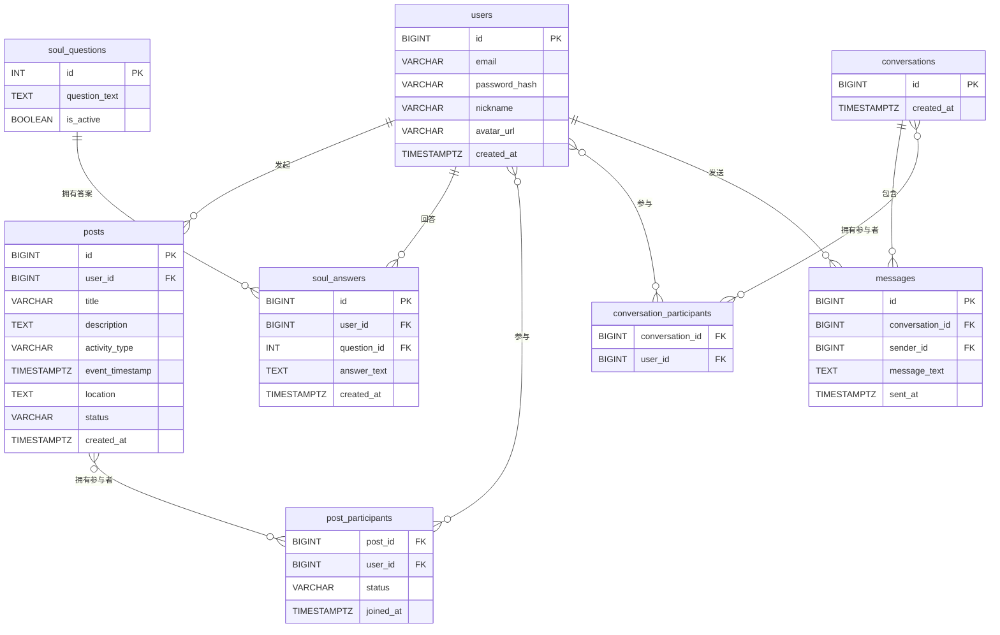

# 同频搭子 - 数据库设计文档 (V2.0)

**版本：2.0**
**关联架构文档：architecture_v2.md**

## 1. 概述

本文档基于PostgreSQL数据库，为“同频搭子”App的核心功能设计详细的数据表结构、字段和关系。设计旨在保证数据一致性、性能和未来的可扩展性。

## 2. 实体关系图 (ERD)

## 3. 数据表详细设计

### 3.1 `users` - 用户表
存储用户的核心身份认证和基础信息。

| 字段名          | 数据类型              | 描述                     | 约束/备注                  |
| :-------------- | :-------------------- | :----------------------- | :------------------------- |
| `id`            | `BIGSERIAL PRIMARY KEY` | 用户唯一ID               | 自增主键                   |
| `email`         | `VARCHAR(255)`        | 登录邮箱                 | `UNIQUE, NOT NULL`         |
| `password_hash` | `VARCHAR(255)`        | 加密后的密码哈希值       | `NOT NULL`                 |
| `nickname`      | `VARCHAR(50)`         | 用户昵称                 | `UNIQUE, NOT NULL`         |
| `avatar_url`    | `TEXT`                | 头像图片的URL            |                            |
| `created_at`    | `TIMESTAMPTZ`         | 账户创建时间             | `DEFAULT NOW()`            |

### 3.2 `posts` - 搭子邀约表
存储“搭子广场”上的所有邀约信息。

| 字段名            | 数据类型              | 描述                     | 约束/备注                  |
| :---------------- | :-------------------- | :----------------------- | :------------------------- |
| `id`              | `BIGSERIAL PRIMARY KEY` | 邀约唯一ID               | 自增主键                   |
| `user_id`         | `BIGINT`              | 发布者ID                 | `FK to users(id)`          |
| `title`           | `VARCHAR(255)`        | 邀约标题                 | `NOT NULL`                 |
| `description`     | `TEXT`                | 详细描述                 |                            |
| `activity_type`   | `VARCHAR(50)`         | 活动类型 (如: 运动, 美食) | `INDEX`                    |
| `event_timestamp` | `TIMESTAMPTZ`         | 活动计划开始时间         | `NOT NULL`                 |
| `location`        | `TEXT`                | 地点文字描述或坐标       |                            |
| `status`          | `VARCHAR(20)`         | 状态 (open, closed, full) | `DEFAULT 'open'`           |
| `created_at`      | `TIMESTAMPTZ`         | 发布时间                 | `DEFAULT NOW()`            |

### 3.3 `post_participants` - 邀约参与者表
记录用户与邀约的参与关系。

| 字段名      | 数据类型      | 描述               | 约束/备注                                |
| :---------- | :------------ | :----------------- | :--------------------------------------- |
| `post_id`   | `BIGINT`      | 邀约ID             | `FK to posts(id)`, `PK`                  |
| `user_id`   | `BIGINT`      | 参与者ID           | `FK to users(id)`, `PK`                  |
| `status`    | `VARCHAR(20)` | 状态 (pending, approved) | `DEFAULT 'pending'`                      |
| `joined_at` | `TIMESTAMPTZ` | 加入时间           | `DEFAULT NOW()`                          |

### 3.4 `soul_questions` - 灵魂问题表
存储“灵魂回响”模块的问题库。

| 字段名          | 数据类型      | 描述         | 约束/备注        |
| :-------------- | :------------ | :----------- | :--------------- |
| `id`            | `SERIAL PRIMARY KEY` | 问题唯一ID   | 自增主键         |
| `question_text` | `TEXT`        | 问题文本     | `NOT NULL`       |
| `is_active`     | `BOOLEAN`     | 是否当前可用 | `DEFAULT true`   |

### 3.5 `soul_answers` - 灵魂回答表
存储用户对灵魂问题的回答。

| 字段名        | 数据类型              | 描述         | 约束/备注                                |
| :------------ | :-------------------- | :----------- | :--------------------------------------- |
| `id`          | `BIGSERIAL PRIMARY KEY` | 回答唯一ID   | 自增主键                                 |
| `user_id`     | `BIGINT`              | 回答者ID     | `FK to users(id)`                        |
| `question_id` | `INT`                 | 问题ID       | `FK to soul_questions(id)`               |
| `answer_text` | `TEXT`                | 回答文本     | `NOT NULL`                               |
| `created_at`  | `TIMESTAMPTZ`         | 回答时间     | `DEFAULT NOW()`                          |

*（为简洁起见，聊天相关的表 `conversations`, `conversation_participants`, `messages` 仅在ERD中展示，其字段结构为标准设计，此处不再详述。）*

## 4. 关系与索引策略

- **外键约束**：在所有`_id`字段上建立外键约束，确保数据的引用完整性。
- **索引**：将在高频查询条件的字段上建立索引，例如 `posts(user_id)`, `posts(activity_type)`, `soul_answers(user_id, question_id)` 等，以提升查询性能。
